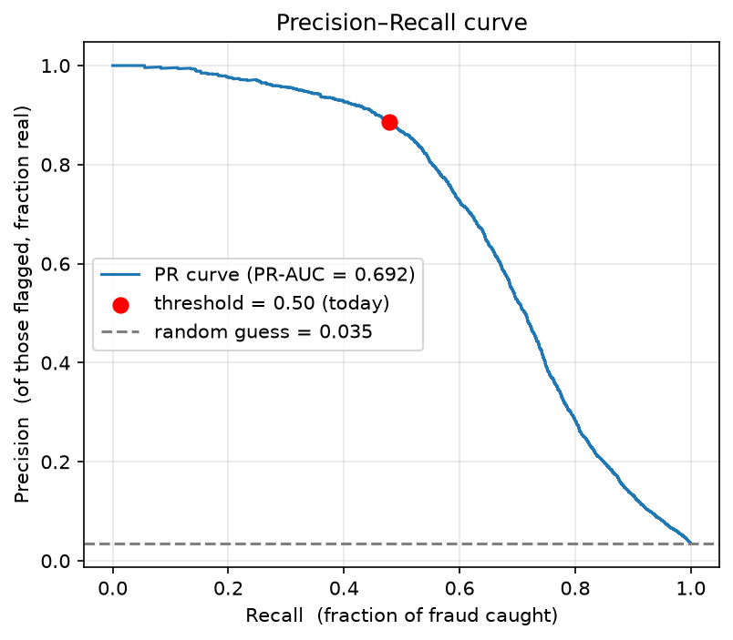
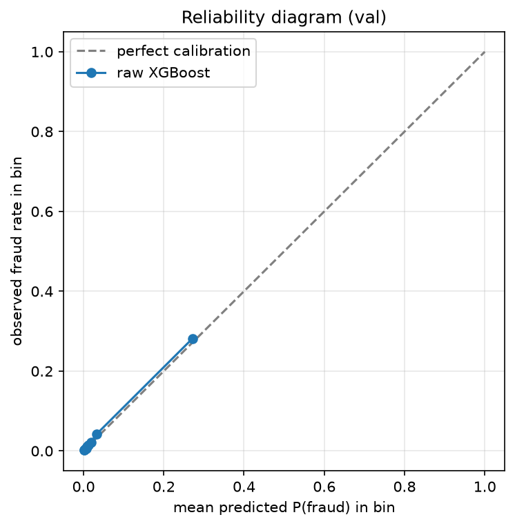
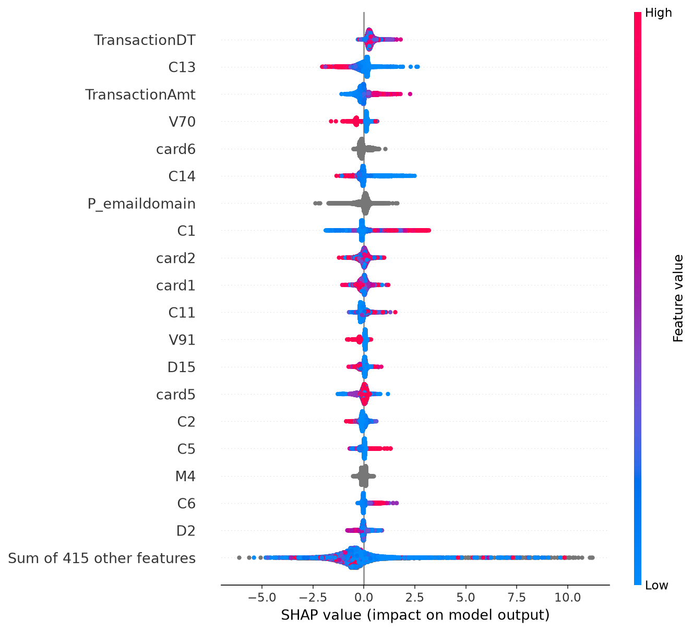

# Fraud Triage on IEEE-CIS: What Actually Moved the Needle

*An honest account of building an explainable fraud-detection pipeline — including
the techniques that didn't work, and the inflated numbers we deliberately reproduced.*

---

## Executive summary

We built a fraud-triage model on the IEEE-CIS transaction dataset (590k transactions,
3.5% fraud) with per-claim SHAP explanations. Headline results, all on a leakage-aware
temporal validation set:

| | PR-AUC (val) |
|---|---|
| Naive baseline, random split | 0.693 — **inflated, ~0.14 of it was leakage** |
| Same model, temporal split | **0.557** — the honest floor |
| + class weighting | 0.525 — worse |
| + SMOTE (correctly applied) | 0.560 — noise |
| + SMOTE (leaky, before split) | **0.998 — fake**, reproduced on purpose |
| + feature engineering | **0.577** — the only real lift |

The three findings that matter:

1. **Evaluation methodology dominated everything.** Switching from a random to a
   temporal split changed the score more than any modeling technique we tried.
2. **Imbalance handling moved thresholds, not knowledge.** At equal investigator
   workload, class weighting and SMOTE caught the same fraud as doing nothing.
3. **Explainability doubled as model interrogation.** SHAP exposed the model's top
   global feature as raw calendar time; a removal experiment showed it carries real
   near-horizon signal and kept it. Explanations also surfaced a linked fraud burst
   across separate claims (6 matches, 100% fraud).

## 1. The problem is triage, not classification

An insurer processes thousands of claims with a handful of investigators. The
deliverable is not a yes/no gate but a **ranked, explained shortlist**: which claims
should humans look at, and why. Under UK/EU rules on automated decisioning, the "why"
is not optional. This shapes everything below: threshold-free ranking metrics
(PR-AUC), operating points expressed as investigator budgets, and per-claim Shapley
explanations as a first-class output.

At 3.5% prevalence, accuracy is a decoy: predicting "legitimate" for every
transaction scores 96.5%. Our first baseline scored 97.96% while missing **52% of
all fraud**. ROC-AUC is similarly flattering (0.94 against a PR-AUC of 0.69): the
huge easy negative class inflates it. Everything below uses PR-AUC.

## 2. Honest evaluation cost us 0.14 PR-AUC — and was the point

Fraud data is time-ordered; production models predict the future from the past.
A random split lets the model train on the future, and it exploited that generously:

| Evaluation | PR-AUC | Recall @ 0.5 |
|---|---|---|
| Random 80/20 split | 0.693 | 47.8% |
| Temporal split — near future (val) | 0.557 | 38.5% |
| Temporal split — far future (test) | 0.448 | 32.7% |

Two separate effects: the **val drop is de-leakage** (~0.14 of the random-split score
was the model reading tomorrow's newspaper), and the **val→test drop is concept
drift** — the model decays as the world moves away from its training window. We
measured this decay repeatedly at every later stage (e.g. 0.577 → 0.545 across the
two halves of the validation window). Production implication: this model needs
rolling retraining and drift monitoring, and any vendor metric quoted off a shuffled
split should be discounted heavily.

Protocol from here: all decisions (thresholds, feature choices, model selection) are
made on the validation window; the test window is scored once, at the end.

## 3. Imbalance handling: three techniques, no knowledge added

The mandated comparison: class weighting (`scale_pos_weight=29`), SMOTE, and
threshold-moving, on identical models and the identical temporal harness.

| Treatment | PR-AUC (val) | Recall @ 3,000-claim budget |
|---|---|---|
| None (control) | 0.557 | 44.9% |
| Class weighting | 0.525 | 42.0% |
| SMOTE (correct) | 0.560 | 44.6% |

At **equal investigator workload**, nobody beat doing nothing. The theory predicts
this: PR-AUC is a pure ranking metric, and reweighting approximately multiplies every
predicted odds by a constant — a monotone transformation that cannot improve ranking.
What weighting *did* do is inflate scores 5× (mean predicted fraud rate 0.21 vs true
0.039), destroying their interpretation as probabilities. Threshold-moving achieves
the same recall shift transparently, without the calibration damage.

SMOTE's synthetic minority points are interpolations between existing frauds — no new
information — and its kNN step can't handle missing values, forcing a median-imputation
stage into a pipeline XGBoost didn't otherwise need. Its scores barely differed from
the control's on real data (mean 0.043 vs 0.037): the model learned the synthetic
manifold and mostly ignored it at inference.

### 3b. The leakage bug, reproduced on purpose

Applying SMOTE **before** the train/test split — a mistake visible in many public
fraud-detection projects — produced **PR-AUC 0.998**. Two frauds committed at once:
synthetic near-copies of test rows leak into training, and the test set itself becomes
50% synthetic fraud (real prevalence: 3.5%). The 0.55–0.56 honest numbers and the
0.998 fake one are the same technique, the same data, three lines apart. This is the
single most instructive result in the project.

## 4. Features: the only real lift — with one rejected family

Cumulative ablation, each family priced separately:

| Feature set | PR-AUC (val) | Δ |
|---|---|---|
| Numeric only (as inherited from the baseline) | 0.557 | — |
| + 31 categorical columns (native XGBoost) | 0.574 | **+0.017** |
| + hour / day-of-week | 0.577 | +0.003 |
| + per-card amount statistics | 0.570 | **−0.007, rejected** |

Restoring the categoricals the baseline had discarded — a single decision — beat every
imbalance technique combined. Time-of-day added little despite a 5× hourly swing in
fraud rate: the model could already reach that signal through the raw timestamp.
Per-card statistics *hurt*: with thousands of card levels, many statistics are
estimated from a handful of rows, and the trees dutifully overfit the noise. Rejected
and documented rather than silently kept.

Categorical vocabularies are fitted on the training window only; unseen future values
(6.9% of validation's browser versions) map to "missing". This is both leakage hygiene
and the exact rule the serving layer applies to next month's claims.

## 5. Calibration: verified, and deliberately not applied

If scores feed cost decisions and human-facing explanations, 0.8 must mean roughly
"80% of such claims are fraud". The reliability diagram says our raw scores already do:
near-diagonal curve, mean prediction 0.036 vs true rate 0.039, Brier 0.0237 against
0.0375 for a base-rate-only predictor. This is expected, not lucky — log-loss is a
proper scoring rule and we train on the true, unweighted distribution. (The
class-weighted model from §3, by contrast, would have needed real repair.)

Platt scaling and isotonic regression were fitted on the first half of the validation
window and judged on the second: ≤1% Brier improvement, and isotonic *costs* 0.011
PR-AUC through ranking ties. Both rejected. Verification, not calibration, was the
deliverable — and Platt's PR-AUC matching the raw model to four decimals is the
monotone-invariance theorem confirmed empirically.

## 6. Explanations: exact, useful, and diagnostic

TreeSHAP gives exact Shapley values for tree ensembles in polynomial time. Local
accuracy verified numerically: baseline + contributions reconstructs the model output
to 7×10⁻⁶ across 20,000 claims. Explanations here are decompositions of the
prediction, not approximations of it.

**Global:** the beeswarm's top feature is `TransactionDT` — raw calendar time (mean
|φ| = 0.32). That smelled like memorized fraud waves rather than fraud knowledge, so
we tested it: retraining without the feature is worse in both the near half
(0.598 vs 0.602) and the far half (0.533 vs 0.545) of the validation window, and
decays slightly faster (+0.066 vs +0.057). At this horizon, recent fraud intensity is
genuine signal; the feature stays. The unresolved part is structural: beyond the data
window, every future timestamp falls past the trees' last split point, so the
feature's long-horizon value cannot be measured from this dataset — one more argument
for a rolling retraining cadence. The instructive part is the method: the explanation
layer generated a concrete hypothesis, and a cheap experiment settled it.

**Local:** the three highest-scored validation claims are all true fraud at P≈1.0,
each with a feature-level argument — including counter-evidence: one claim carries a
−1.15 push from a single feature, overwhelmed by the rest.
Two of the three share a device, amount, email domain and near-consecutive IDs:
**the same actor**. The full device+amount pattern matches 6 validation claims —
100% of them fraud. Explanations turned separate alerts into one case.

**Limits:** roughly 3 of the top-10 global features are investigator-readable
(`TransactionAmt`, `card6`, `P_emaildomain`); the largest per-claim pushes come from
Vesta's anonymized `V*`/`C*` columns. On this dataset, explanations are
half-actionable by construction — the argument for porting the pipeline to a dataset
with named business features.

## 7. What didn't work — kept on the record

- Class weighting: −0.03 PR-AUC and 5×-inflated scores.
- SMOTE: a wash at best, plus a forced imputation dependency.
- Per-card amount statistics: overfit noise, net negative.
- A flat 100:1 cost model: produced a degenerate "flag everything" optimum
  (threshold 0.01, 42,846 false alarms). Cost-sensitive thresholds are only as good
  as the cost estimates; capacity-based budgets were more robust in practice.
- A silent pipeline bug during notebook→module extraction (dtype mismatch dropped all
  31 categorical features, no error, plausible score) — caught only by a
  reproducibility assertion. Train/serve skew is real and quiet.

## 8. Production posture

The model decays measurably within weeks (0.577 near / 0.545 far within validation
alone) — retraining cadence and drift monitoring are requirements, not nice-to-haves.
All fitted state (category vocabularies, model, thresholds) is produced on the
training window only and persisted as artifacts, so serving matches training by
construction. The scoring service exposes `{fraud_score, decision, top SHAP reasons}`
per claim.
The scoring service (FastAPI) exposes `POST /score` — any subset of claim fields in,
`{fraud_score, decision, top SHAP reasons}` out — plus demo endpoints over 500 stored
held-out claims. Score and explanation come from a single tree pass via XGBoost's
built-in TreeSHAP.
